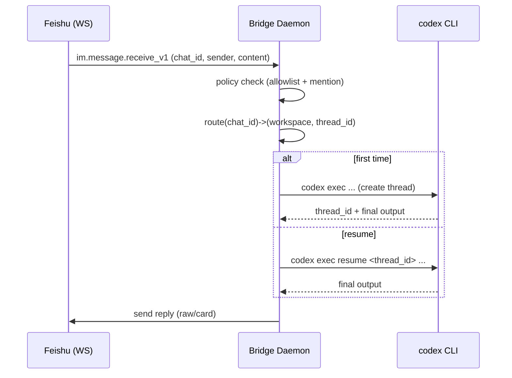

# Codex Feishu 长连接任务机器人：产品设计文档

本文档目标：基于你本机 OpenClaw 的 Feishu 长连接实现与配置形态，定义一个在 Codex 体系下“等价能力”的产品方案：无需公网回调/公网 IP，通过 Feishu Socket(WebSocket) 接收任务并把执行结果回传到同一会话。

## 1. 背景与目标

### 背景
- 你当前 OpenClaw 配置中启用了 `channels.feishu`，并且 Feishu 插件默认 `connectionMode=websocket`，使用飞书官方 Node SDK 的 `WSClient + EventDispatcher` 收取 `im.message.receive_v1` 事件。
- OpenClaw 将“会话(群/私聊)”映射到内部 `sessionKey`，并通过统一的 reply dispatcher 将模型输出拆分/渲染后发回飞书。

Codex 侧没有“原生 Feishu channel”概念，但 Codex CLI 可被当作可调用的执行引擎（`codex exec` / `codex exec resume`），因此采用“桥接进程 + Codex CLI”的方式实现同等体验。

### 目标（MVP）
1. 通过 Feishu Socket 长连接接收消息，不依赖公网回调。
2. 将消息路由到某个 Codex 会话（可连续对话）。
3. 将 Codex 的最终输出回传到飞书（可选：过程中增量回传）。
4. 安全默认：群聊需要 @ 才触发；私聊支持 allowlist/pairing。

### 非目标（MVP 不做）
- 在飞书内直接展示/应用 patch、审批工作流、权限分级审批（可作为后续）。
- 支持所有飞书消息类型（先 text/post，附件后续）。
- 多租户、多团队复杂 RBAC。

## 2. 用户体验（UX）

### 2.1 触发方式
- 群聊：必须 @ 机器人（默认），否则仅记入“上下文历史”(可选)不触发执行。
- 私聊：按策略 `pairing/allowlist/open` 决定是否响应。

### 2.2 对话与任务模型
- 同一个飞书会话（chat_id）绑定一个 Codex thread：
  - 第一次触发：创建新 thread 并记录映射关系。
  - 后续消息：对同一 thread 调用 `codex exec resume <thread_id> ...`。
- 并发策略：
  - 默认：同一 chat 串行队列，避免上下文交叉。
  - 不同 chat 可并行。

### 2.3 回复呈现
回复支持两种渲染模式（可配置）：
- `raw`：纯文本（必要时将 Markdown 表格转 ASCII）。
- `card`：飞书 interactive card / post Markdown（适合代码块/表格）。
- `auto`：检测到 fenced code block 或表格则用 card，否则 raw。

### 2.4 进度与“正在处理”
MVP 推荐：
- 发送 1 条“已收到，正在处理”的短消息。
- 任务执行超过阈值（如 30s）时每隔 N 秒追加“仍在处理”心跳（可配置隐藏）。
进阶（可选）：
- 用 reaction 作为“typing indicator”替代（OpenClaw 的做法）。

### 2.5 控制命令（建议内置）
以文本命令（或前缀）形式实现，避免依赖飞书 slash command 配置：
- `help`：展示用法、当前绑定工作区、当前安全策略。
- `status`：展示队列长度、当前执行中的任务、最近一次错误。
- `reset`：清空该 chat 对应的 Codex thread 映射（从头开始）。
- `cwd <name>`：切换该 chat 的工作区映射（仅在 allowlist 的管理员可用）。
- `sandbox read-only|workspace-write`：切换执行策略（仅管理员）。

## 3. 配置与策略

### 3.1 形态对齐（参考 OpenClaw）
OpenClaw 的 Feishu 配置结构（概念上）：
- `enabled`
- `appId/appSecret`
- `connectionMode=websocket`
- `dmPolicy/groupPolicy/allowFrom/groupAllowFrom`
- `requireMention`
- `renderMode`
-（可选）多账号 `accounts`

Codex 侧桥接进程建议保持相同语义，降低迁移成本。

### 3.2 建议的配置文件（桥接进程）
路径：`~/.codex/feishu-bridge/config.toml`
- `feishu.app_id`, `feishu.app_secret`（不写进 git）
- `feishu.domain`（feishu/lark 或私有化 base URL）
- `feishu.connection_mode = "websocket"`（MVP 只支持 websocket）
- `policy.dm = "pairing"|"allowlist"|"open"`
- `policy.group = "allowlist"|"open"|"disabled"`
- `policy.require_mention = true`
- `policy.allow_from_user_open_ids = [...]`
- `policy.allow_from_group_chat_ids = [...]`
- `routing.chat_to_workspace = { "<chat_id>" = "/abs/path/to/repo", ... }`
- `routing.default_workspace = "/abs/path"`
- `codex.model`（可选），`codex.sandbox_default`

### 3.3 安全默认值（推荐）
- 群聊：`groupPolicy=allowlist` + `requireMention=true`
- 私聊：`dmPolicy=pairing`
- Codex：默认 `sandbox=read-only`，需要写时显式升级（或按 allowlist 用户提升）。

## 4. 端到端流程（MVP）

## 5. 失败与降级策略
- 飞书 WS 断线：自动重连（指数退避），期间发一条“连接中断”到管理员群/日志。
- Codex 执行失败：将 stderr 摘要回传到触发会话，并记录错误计数。
- 消息风暴/重复事件：按 `message_id` 去重，避免重复执行。
- 输出过长：分片发送；超过上限则上传为文件/云盘链接（后续）。

## 6. 验收标准（MVP）
1. 在 allowlist 群里 @ 机器人发送任务，能在同一群里收到结果。
2. 在非 allowlist 群里 @ 机器人不会触发。
3. 同一群连续问 3 轮，语义上下文保持（使用同一 thread）。
4. 断网/重启 bridge 后，仍可继续（thread 映射持久化）。

